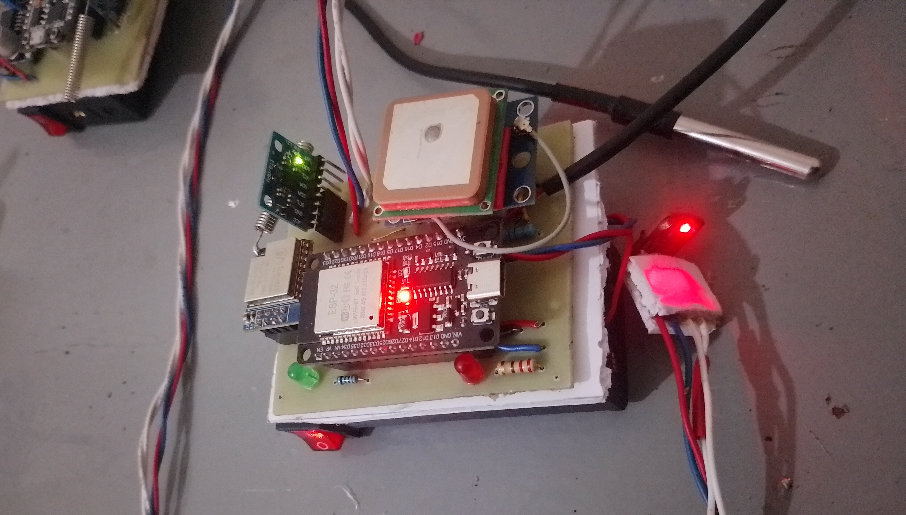
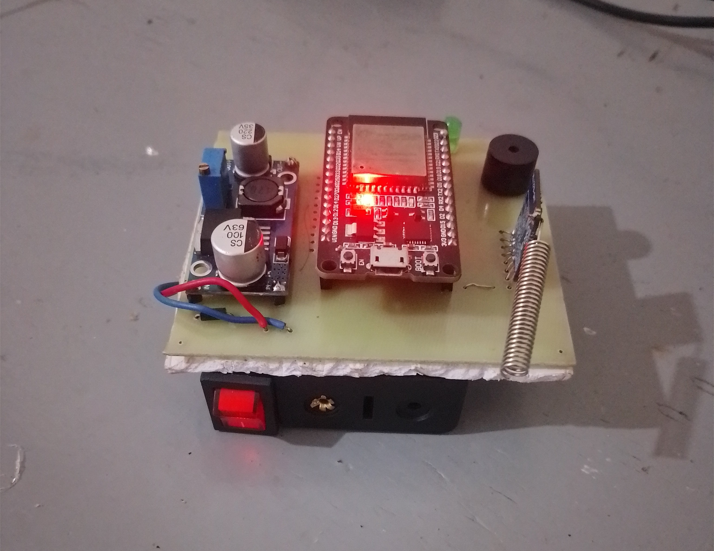

# Low-Powered Electronic Livestock Tag for Geofencing & Activity Monitoring

**Date**: May 2025

## Project Overview

This project develops a smart, low-power electronic tag for livestock in free-grazing systems. It provides **real-time GPS tracking**, **geofencing alerts**, **activity monitoring** via accelerometer, and **vital signs** (temperature, heart rate, SpO2) using IoT/LoRa communication.

**Key Features**:
- Real-time location tracking with u-blox NEO-6M GPS
- Geofencing with custom boundaries
- Activity monitoring using MPU6050 (accelerometer)
- Environmental & vital monitoring: DS18B20 temperature + GY-MAX30100 Oximeter
- Long-range LoRa communication (AI-Thinker Ra-01 433MHz)
- Data forwarding via ESP32 WiFi to web dashboard

## Hardware Components

### Transmitter (Tag - On-Animal Unit)
- **MCU**: ESP32 DevKit
- **LoRa**: AI-Thinker Ra-01 (433MHz)
- **GPS**: GY-GPS6MV2 (u-blox NEO-6M)
- **IMU**: HW123 ITG  (3-axis accelerometer)
- **Temp**: DS18B20
- **Pulse Ox**: GY-MAX30100

*(See `hardware/images/` below for detailed component photos)*

### Receiver (Base Station)
ESP32 + LoRa receiving data and pushing to web server.

## Dashboard

The system includes a **web-based dashboard** at `https://dashboard-kirigha.vercel.app`.

**Features**:
- Real-time visualization of all tags on an interactive map
- Virtual geofence overlay
- Live sensor data: Temperature, Heart Rate (BPM), SpO2, Accelerometer (AX/AY/AZ), Location
- Alert system for geofence breaches, abnormal vitals, and inactivity
- Historical data logging for grazing pattern analysis and health trends

Data is sent from the Receiver every ~2 seconds and stored for monitoring from any device.

*(Screenshots of the dashboard can be found to `dashboard/images/`)*

## Firmware

- **Transmitter**: FreeRTOS multi-tasking architecture for **stable and accurate sensor readings** (see `firmware/transmitter/`)
- **Receiver**: Packet parsing, alert logic (temp, BPM, SpO2, motion, geofence), and HTTPS POST to dashboard (see `firmware/receiver/`)

**Note on Accuracy**: Calibration and proper contact are critical for reliable BPM/SpO2 data from the MAX30100 module.

## Setup Instructions

1. Clone the repository
2. Flash Transmitter & Receiver sketches via Arduino IDE / PlatformIO
3. Update WiFi credentials & server URL in `firmware/receiver/receiver.cpp`
4. Adjust geofence center coordinates (`centerLat`, `centerLon`)
5. Setup a realtime database on firebase
6. Setup a vercel project with `dashboard` as your root directory
7. Setup your database configuration details as environment variables in vercel
8. Deploy the dashboard `dashboard/index.html`

## Subsystem Tests & Accuracy Notes

- **LoRa**: Stable at 433MHz (SF7, 125kHz BW)
- **Sensors**: Multi-tasking ensures non-blocking, accurate readings
- **MAX30100**: New module — focus on proper LED current and sensor placement for reliable vitals
- **Power**: Optimized for battery life (further deep-sleep improvements planned)

## Future Work (per Project Proposal)

- Full deployment & field testing
- Solar-powered rugged enclosure
- Machine learning for advanced activity classification
- Mobile app push notifications
- Full field deployment and veterinary validation

## Contributors

- Ochieng Acheng Tabby
- Alex Thiong'o Wandugu

---

**Status**: Prototype complete
